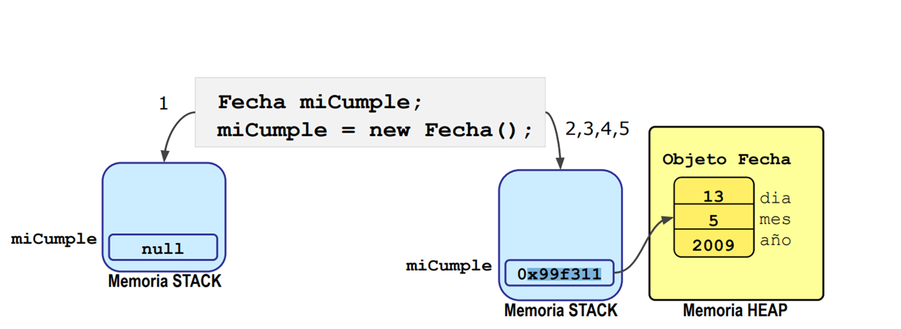
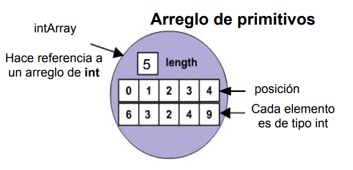
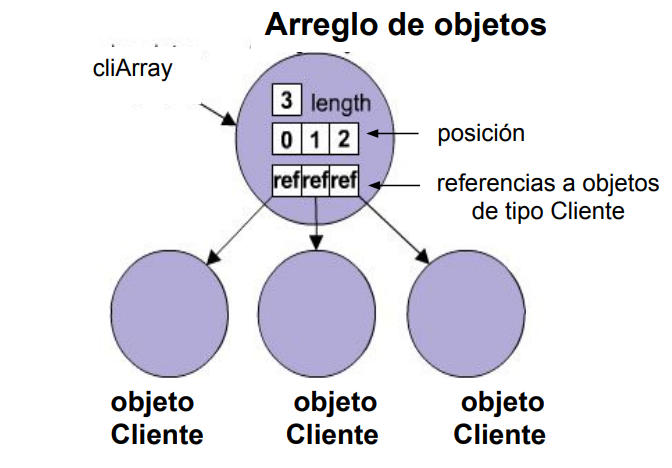

<h1> Resumen Semana 1 </h1>

<h3>✨ Definición de clases e instanciación </h3>

Los programas **orientados a objetos**, están formados por objetos que se comunican entre sí a través del **envío de mensajes**.<br>
Cuando el programa se está ejecutando, los objetos creados se van almacenando en la memoria **HEAP**.
* Cada uno de estos objetos combina un **Estado de datos** y un **Comportamiento**.
* Estos objetos se crean a partir de un molde o **clase**.

<h5>📌 Como declarar una clase? </h5>

* Una clase es un molde, que describe el estado y el comportamiento que tendrán los objetos que con ellos se creen.
* El archivo origen Java deberá contener como mínimo:
 * En la primera linea la palabra **package** seguida del nombre del paquete.
 * La palabra clave class seguida del nombre de la clase.
* Un archivo de origen Java debe guardarse con el mismo nombre que la clase.

```java
package whatsapp;
import java.awt.Image;
public class Contacto {
  // Estado
  private String nombre;
  private Image imagen;
  private String estado;
  private int id;

  // Comportamiento
  public String getNombre() {
    return nombre;
  }
  public void setNombre(String nombre) {
    this.nombre = nombre;
  }
 . . .
}
```
Para agregar **estado** y **Comportamiento** debemos incluir:
* **Variables de instancia**: Constituye el <u>estado</u> de un objeto. Normalmente se declaran <u>private</u>, es decir que se pueden acceder a ellas <u>solo desde la clase en que se definen</u>.<br>
Su declaración implica:
 * Un <u>identificador</u> o nombre de la variable.
 * Un <u>tipo</u> de dato primitivo o referencial.
 * Un <u>especificador de acceso</u>:
    - 1) public
    - 2) protected
    - 3) private
    - 4) static
    - 5) final


* **Metodos de instancia**: definen las <u>operaciones</u> que se pueden realizar con los objetos de una clase dada. *(Similar a procedimientos/funciones en pascal)* <br>
La declaración de un metodo implica:
 * Un <u>nombre</u>
 * Una lista de <u>argumentos</u> (Opcional)
 * Un <u>tipo</u> de retorno.
 * Un <u>modificador de acceso</u> (Opcional)

<h3>✨Tipo de datos en Java</h3>

<h5>📌 Inicializacion</h5>

Cuando la definición de una clase no inicializa las variables de instancia, las mismas toman **valores por defecto**.

<table>
  <tr>
    <td bgcolor = #FFD700 style="color:#000000" >Tipo</td>
    <td bgcolor = #FFD700 style="color:#000000">Dato</td>
    <td bgcolor = #FFD700 style="color:#000000">Default</td>
  </tr>
  <tr>
    <td>Primitivo</td>
    <td>boolean</td>
    <td>false</td>
  </tr>
  <tr>
    <td>Primitivo</td>
    <td>char</td>
    <td>‘\uoooo’ (nulo)</td>
  </tr>
  <tr>
    <td>Primitivo</td>
    <td>byte/short/int/long</td>
    <td>0</td>
  </tr>
  <tr>
    <td>Primitivo</td>
    <td>float/double</td>
    <td>0.0</td>
  </tr>
  <tr>
    <td>Referencia</td>
    <td>Ref a objetos</td>
    <td>null</td>
  </tr>
</table>


***Las variables locales, deben inicializarse explícitamente antes de usarse***

<h5>📌 Clases wrappers </h5>

* Por razones de eficiencia, los datos numericos, boolean y caracteres se tratan en su forma primitiva.
* Java proporciona clases wrappers para <u>manipular a los tipos primitivos como objetos</u>
* Cada objeto de la clase wrapper encapsula a un único valor primitivo.
* Las clases wrapper son inmutables.

<table>
  <tr>
    <td bgcolor = #FFD700 style="color:#000000" >Tipo Primitivo</td>
    <td bgcolor = #FFD700 style="color:#000000">Clase Wrapper</td>
  </tr>
  <tr>
    <td>char</td>
    <td>Character</td>
  </tr>
  <tr>
    <td>boolean</td>
    <td>Boolean</td>
  </tr>
  <tr>
    <td>byte</td>
    <td>Byte</td>
  </tr>
  <tr>
    <td>short</td>
    <td>Short</td>
  </tr>
  <tr>
    <td>int</td>
    <td>Integer</td>
  </tr>
  <tr>
    <td>long</td>
    <td>Long</td>
  </tr>
  <tr>
    <td>float</td>
    <td>Float</td>
  </tr>
  <tr>
    <td>double</td>
    <td>Double</td>
  </tr>
</table>

A partir de la version 5 de Java, se dispone de **conversiones automáticas** de los tipos primitivos a sus correspondientes wrappers y viceversa, lo que se conoce como <mark>autoboxing</mark>.

```java
Long suma = 0;
long antes = System.currentTimeMillis();
for (int i = 0; i < Integer.MAX_VALUE; i++){
  suma += i;
}
long despues = System.currentTimeMillis();
```
*En el ejemplo anterior, el tiempo de ejecución aumenta considerablemente dado que en cada iteración se convierte la variable i de tipo primitivo a su correspondiente wrapper, para poder sumarlo a la variable suma de tipo Long.*

```java
long suma = 0;
long antes = System.currentTimeMillis();
for (int i = 0; i < Integer.MAX_VALUE; i++){
  suma += i;
}
long despues = System.currentTimeMillis();
```
*En este caso el tiempo de ejecución es menor, ya que el resultados e acumula en el tipo primitivo long.*

<h3>✨ Instanciación de clases </h3>
Para crear un objeto de una clase, se usa el operador <mark>new</mark>.<br>
Pasos que involucra:

* Se aloca espacio para la variable.
* Se aloca espacio para el objeto en la **HEAP** y se inicializan los atributos con valores por defecto.
* Se inicializan explícitamente los atributos del objeto.
* Se ejecuta el **contructor**.
* Se asigna la referencia del objeto a la variable.



<h5>📌 Constructores</h5>

Los constuctores son piezas de código que permiten <u>definir el estado inicial</u> de un objeto, al momento de su creación.<br>
La <u>diferencia</u> con los métodos radica en:
* Deben tener el mismo nombre que la clase.
* No retornan valor.
* Son invocados automáticamente.

Cuando un objeto es creado, se aloca almacenamiento en la memoria HEAP y se invoca al constructor, es decir que la <u>inicialización está garantizada</u>

```java
Vehiculo unVehiculo;

unVehiculo = new Vehiculo();

```
* La expresión **new** retorna una referencia al objeto creado, pero el constructor en sí no retorna valor.
* Java llama siempre autmáticamente a un constructor cuando el objeto es creado. De esta forma se garantiza la inicialización del objeto.

<mark> Consctructores sin argumentos </mark>
<br><br>
Son los llamados constructores default.
* Si una clase no tiene constructores, el compilador inserta automáticamente un constructor default con cuerpo vacío.
* Si la clase tiene al menos un constructor, el compilador no insertará nada.

<br>
<mark>Constructores con Argumentos</mark><br><br>
Se utilizan para inicializar los valores del objeto mediante parámetros que se pasan al constructor.

```java
public class Vehiculo {
  private String marca;
  private double precio;

  public Vehiculo(String marca,double precio){
    this.marca = marca;
    this.precio = precio;
  }

```
Si este constructor es el unico en su clase, el compilador no permitirá crear el objeto de otra forma que no sea utilizando el constructor.

<br>
<mark>Sobrecarga de constructores</mark><br><br>
La sobrecarga de métodos, permite que el mismo nombre de método sea utilizado con distintos tipos y argumentos.

```java
// Definición de la clase
public class Vehiculo {
  private String nroPatente=“”;
  private String propietario=“SinDueño”;
  public Vehiculo(){
 }

// Constuctores
 public Vehiculo(String marca){
   this.marca = marca;
 }
 public Vehiculo(String marca,double precio){
   this.marca = marca;
   this.precio = precio;
 }
}
```

```java
public class Botanico {
 public static void main(String[] args ){

// Creación de los objetos.
 Vehiculo a1=new Vehiculo();
 Vehiculo a2=new Vehiculo(“HONDA”);
 Vehiculo a3=new Vehiculo(“HONDA”,12300.50);
 }
}
```

Una vez que se ha creado un objeto,para cambiar su
estado, obtener información o ejecutar alguna acción se necesita conocer la variable que lo referencia y utilizar la notación **"."**

💡Se recomienda declarar todos los atributos privados (private) y utilizar métodos públicos
(public) para acceder al estado.

<h3>✨Variables de instancia y variables locales</h3>

Dentro de una clase, las variables pueden declararse:
* **Afuera de cualquier método:** Son las variables de instancia, creadas cuando el objeto es construído con cualquier new(). Estas variables <u>existen mientras exista el objeto</u>
* **Adentro de cualquier método:** Son llamadas variables locales, y <u>deben inicializarse</u> antes de ser usadas. Estas variables son creadas cuando el método comienza a ejecutar y son <u>destruidas cuando finaliza</u> la ejecución.

<h5>📌 Variables y métodos de clase</h5>

La palabra clave **static**, declara métodos y atributos <u>asociados con la clase</u> en lugar de estar asociados con cada instancia de esa clase.<br>
Estas **variables** de clase son compartidas por todas las instancias de la clase.<br>
En el caso de los **metodos**, se utilizan cuando se necesita algún comportamiento que no depende de alguna instancia en particular.

```java
public class Contacto{
  private static int ultCont = 0;
  private String nombre;
  private Image imagen;
  private String estado;
  private int id;
  public Contacto() {
    ultCont++;
    this.id = ultCont;
  }

  public static int getUltCont {
    return ultCont;
  }
 . . .
}
```
Luego, el método ```Contacto.getUltCont() ``` puede invocarse desde cualquier lugar, aún no habiéndose creado instancias de la clase Contacto.

**Ejemplo**

```java
 public class SumaEnteros {
   public static int sumaValores() {
     Scanner consola = new Scanner(System.in);
     System.out.print("Por favor, ingrese tres números: ");
     int num1 = consola.nextInt();
     int num2 = consola.nextInt();
     int num3 = consola.nextInt();
     int suma = num1 + num2 + num3;
     return suma;
   }

   public static int sumaArreglo(int[] datos){
     int suma = 0;
     for (int i = 0; i < datos.length; i++) {
       suma = suma + datos[i];
     }
     return suma;
   }
 . . .
 /*Los métodos de clase solo tienen acceso a sus variables locales parámetros y variable de clase y no tiene acceso a las variables de instancia. */
 }
 ```

```java
 public class TestSumaEnterso {
   public static void main(String[] args) {
     System.out.println("La suma de los valores que ingresó es " + SumaEnteros.sumaValores());
     int[] datos = { 1, 2, 3, 4, 5 };
     int sumas = SumaEnteros.sumaArreglo(datos);
     System.out.println(" La suma es " + sumas);
 }
}
```

<h3>✨Arreglos en java</h3>

* Es un objeto que <u>hace referencia a un conjunto</u> de valores primitivos u objetos, a través de una única variable.
* Permiten manipular un conjunto de valores del mismo tipo, usando un único nombre.
* Los datos almacenados se guardan en posiciones contiguas.
* Tienen una <u>cantidad fija</u> de elementos, una vez creado la dimensión <u>no puede cambiar</u>.
* Cada arreglo mantiene una propiedad *lenght*, con el tamaño del mismo.


```java
  public class ArreglodePrimitivos {
    public static void main(String[] args){
      int[] intArray = new int[5];
      intArray[0] = 6;
      intArray[1] = 3;
      intArray[2] = 2;
      intArray[3] = 4;
      intArray[4] = 9;
    }
  }
```


```java
  public class ArreglodeClientes {
    public static void main(String[] args){
      Cliente[] cliArray = new Cliente[3];
      cliArray[0] = new Cliente();
      cliArray[1] = new Cliente();
      cliArray[2] = new Cliente();
    }
  }

```


<h5>📌 Declaración e inicialización </h5>

**Varios Pasos**: En la declaración se crea la variable arreglo. Luego el objeto arreglo se crea con el operador *new*, en donde se debe indicar la cantidad de elementos.

```java
  int[] intArray; // sólo declara
  intArray = new int[5]; //crea el declarado arriba
  double montos[]=new double[12]; //declara y crea
  String[] items=new String[4]; //declara y crea

// Se lo inicializa elemento por elemento
  for (int i=0;i<4;i++){
    items[i]=“item”+i;
  }

```

**Un Paso**: la declaración de la variable, la creación del objeto y la inicialización también pueden realizarse en un solo paso.

```java
  int[] intArray = {6, 3, 2, 4, 9};
  Cliente[] cliArray = {new Cliente(), new Cliente(), new Cliente()};
  String[] items = { “item1”, “item2”, “item3”, “item4”};
```

<h5>📌 Recorridos </h5>

El recorrido en un arreglo puede hacerse de dos maneras:

```java
  public class SumaArreglo {
// For tradicional
    public int suma1(int[] a) {
      int result = 0;
      for (int i=0; i<a.length;i++)
      result = result + a[i];
      return result;
    }

// for each    
    public int suma2(int[] a) {
      int result = 0;
      for (int elto: a)
      result = result + elto;
      return result;
    }
}
```

**For tradicional**: Recorre el arreglo desde la primer posición hasta la última, en donde la variable i toma el índice actual en cada iteración, y a[i] es el elemento en dicha posición.<br>
**For each:** Recorre el arreglo desde la primera posición hasta la última. La linea ```  for(int elto:a)``` se lee: *para
cada elemento elto de tipo int, en el arreglo a*


<h5>📌 Recorridos en matrices </h5>

```java
  public class RecorridoMatriz{
    public static void main (String args []){
      int [][] notas = {{66,78,78,89,88,90},
                        {76,80,80,82,90,90},
                        {90,92,87,83,99,94}
                      };
      for (int x = 0; x < notas.length; x ++){
        // recorre filas
        for(int y = 0; y < notas[x].length; y++) {
          // recorre columnas de esa fila
          System.out.println(notas[x][y]);
        }
      }
    }
    // main
  }
```

<h3>✨ Pasaje de Parámetros </h3>

En java, los parámetros se pasan **por valor**, es decir que se pasa una copia del parámetro actual.

**Parámetros formales:** Son los parámetros en la definición del método<br>
**Parámetros actuales/reales:** Son los parámetros en la invocación al método <br>

Dentro del cuerpo del método, se puede cambiar el valor de la copia que se recibe como parámetro, pero no tendrá efectos en el parámetro actual.<br>
Cuando java llama a un método, hace una copia de sus parámetros reales, y envía esas copias al método. Cuando el método finaliza, esas copias se descartan y los valores de las variables en el código principal son los mismos que antes.<br>

<mark>Clases wrapper y clase string: </mark> las clases wrapper y las instancias de string son inmutables, de manera que cuando se modifica el valor a una variable de estos tipos, se **crea una nueva instancia** con el nuevo valor y se asigna a esta variable.<br>

<mark>Tipo de dato referencial:</mark> en java podemos pasar como parámetro una referencia a un objeto, y con ella cambiar el valor de sus variables, pero <u>no podemos cambiar a que objeto se refiere</u>.

```java
  public class PasajePorValor {
    public static void cambiarNombre(Contacto c) {
      c.setNombre("Pilar");
    }

  public static void main(String[] args){
    Contacto c = new Contacto();
    c.setNombre("Lucia");
    PasajePorValor.cambiarNombre(c);
    // se pasa una copia de la referencia a c
    System.out.println(c.getNombre());
  }
}
```
