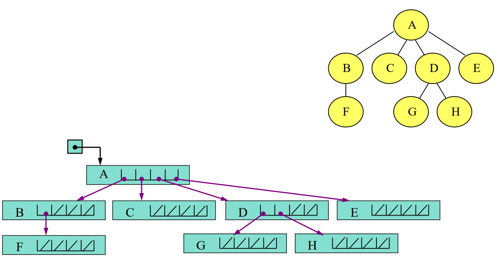
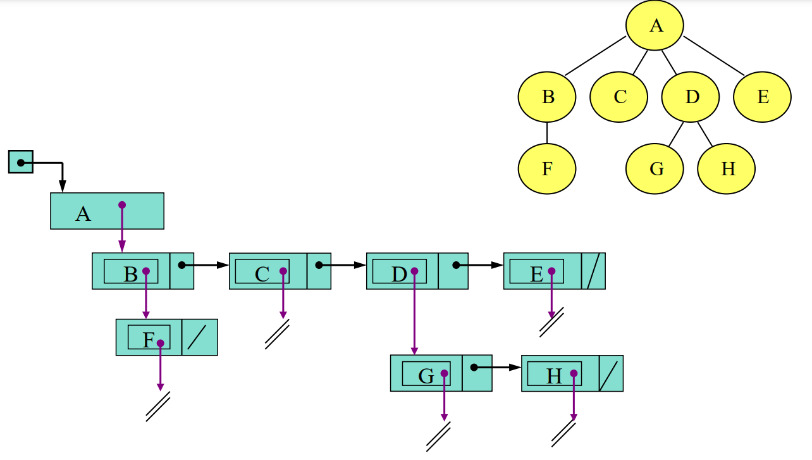
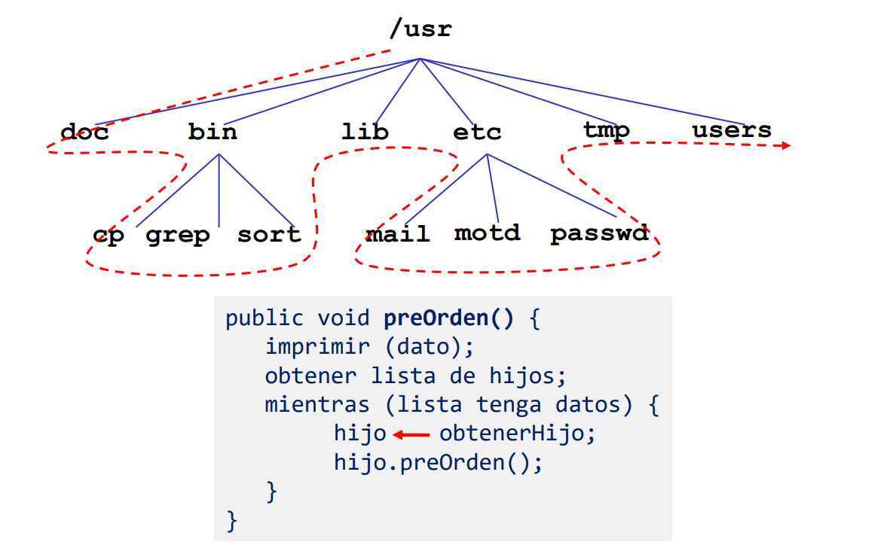
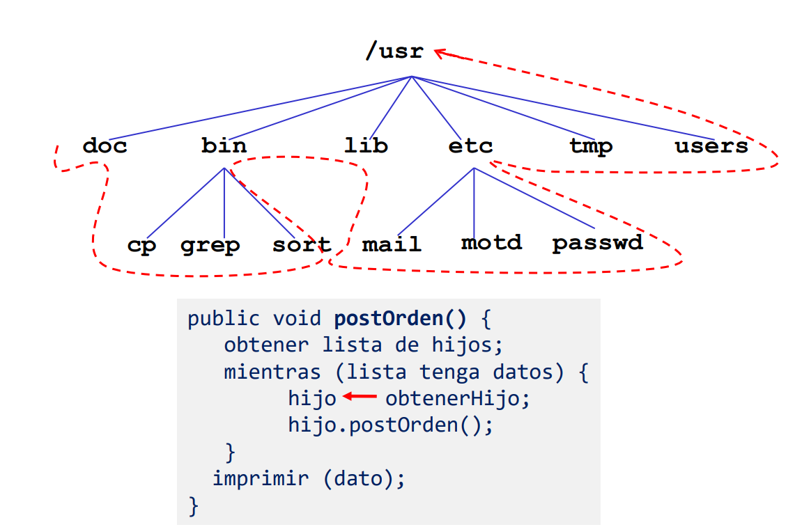
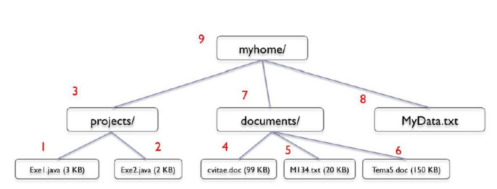
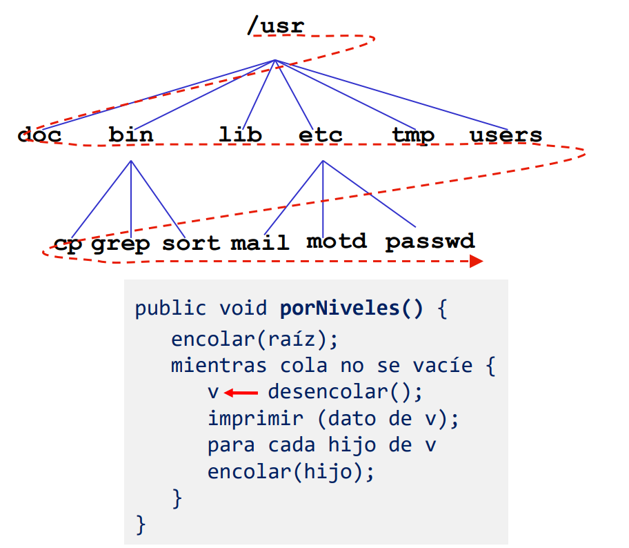

<h1>🌳 Árboles Generales </h1>

<h2> Tabla de contenido</h2>

- [Definicion](#definicion).
- [Descripcion y Terminologia](#descripcion).
- [Ejemplos](#ejemplos).
- [Representaciones](#representaciones).
- [Recorridos](#recorridos).


<h2>Definicion</h2>
<a id="definicion"></a>

Un arbol es una ```coleccion de nodos``` tal que:
* Puede estar vacia
* Puede estar formada por un nodo distinquido **R** (raíz) y un conjunto de árboles **T1**,**T2**,**Tk**, con K>= 0 (Subarboles),
donde la raíz de cada subárbol T está conectado a R por medio de una arista.


<h2>Descripcion y Terminologia</h2>
<a id="descripcion"></a>

* **Grado** de n, es el número de hijos del nodo n.
  * Grado del árbol es el grado del nodo con mayor grado.
* **Altura** de N es el camino mas largo desde N hasta una hoja.
  * Las hojas tienen altura cero
  * La altura del arbol es la altura del nodo raíz.
* **Profundidad** de n, es la longitud del único camino desde la raíz hasta n.
  * La raiz es de profundidad cero.


* **Arbol lleno**: dado un arbol T de grado K y altura H, diremos que está lleno si 
*cada nodo interno tiene grado k* y *todas las hojas están en el mismo nivel h*.<br>
Es decir, T está lleno si:
  * T es un nodo simple
  * T es de altura h y todos sus subarboles son llenos de altura h-1.
  * Cantidad de nodos: (k^(h+1) – 1) / (k-1) 
* **Arbol Completo**: dado un arbol T de grado K y altura H, diremos que está completo si es lleno de altura h-1, y
el nivel H se completa de *izquierda a derecha*.
  * Cantidad de nodos varía entre 
    * (k^(h+k) -2) / (k-1)
    * (k^(h+1) – 1) / (k-1)
    

<h2>Ejemplos</h2>
<a id="ejemplos"></a>

* Organigramas
* Arboles genealogicos
* Sistema de archivos
* Organizacion de un libro (capitulos y secciones)

<h2>Representaciones</h2>
<a id="representaciones"></a>

<mark>Lista de Hijos</mark>
* Cada nodo tiene:
  * Información propia del nodo
  * Una lista de todos sus hijos

<mark>Hijo mas izquierdo y hermano derecho </mark>
* Cada nodo tiene:
  * Información propia del nodo
  * Referencia al hijo mas izquierdo
  * Referencia al hermano derecho 

La **lista de hijos** puede estar implementada a través de 
  * Arreglos
  * Lista dinámica de nodos.

Lista de hijos implementada con arreglos


Lista de hijos implementada con nodos


<h2>Recorridos</h2>
<a id="recorridos"></a>

Los tipos de recorrido pueden ser:
* ```Preorden```: se procesa primero la raíz y luego los hijos
* ```In Orden```: se procesa el primer hijo, luego la raíz, y luego los restantes hijos.
* ```Post Orden```: se procesan primero los hijos y luego la raíz
* ```Por niveles```: se procesan los nodos teniendo en cuenta sus nivels. Primero la raiz, luego los hijos, luego los hijos de estos.

Graficamente:

<mark>PRE ORDEN</mark>


<mark>POST ORDEN</mark>




<mark>POR NIVELES</mark>

