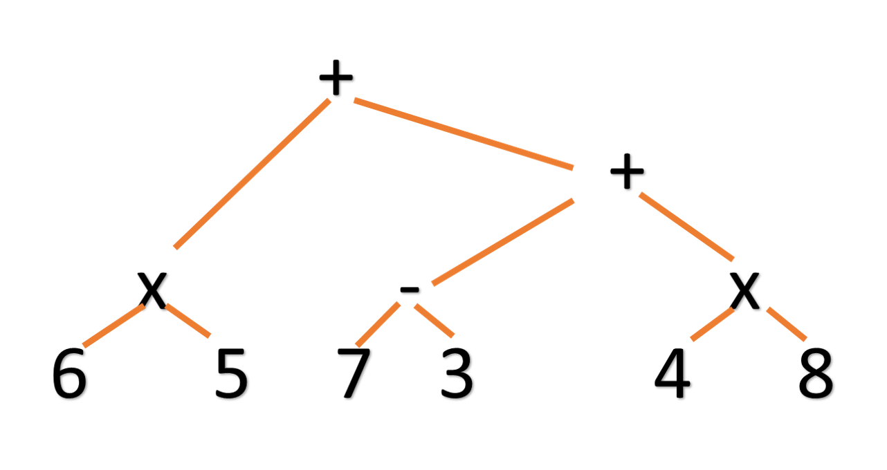
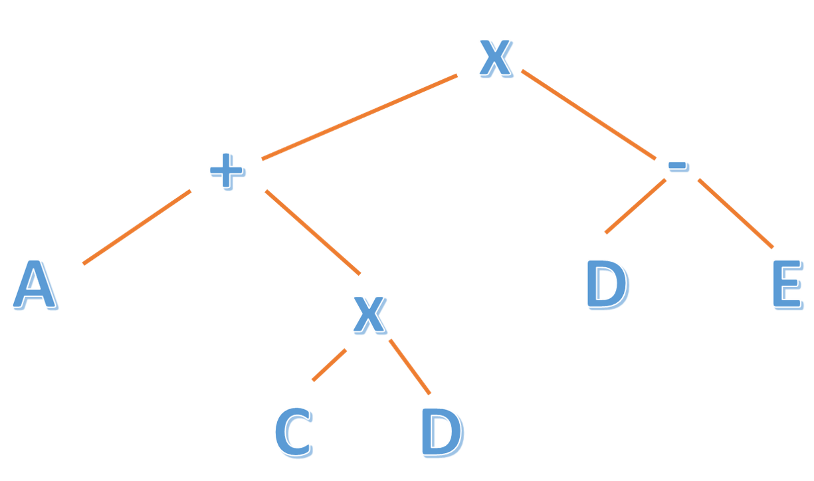
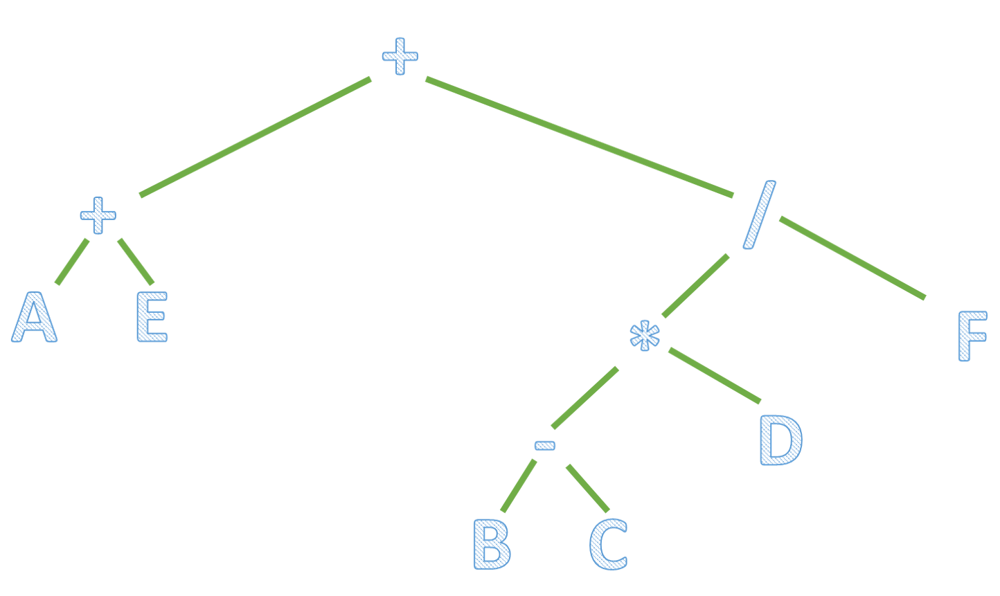
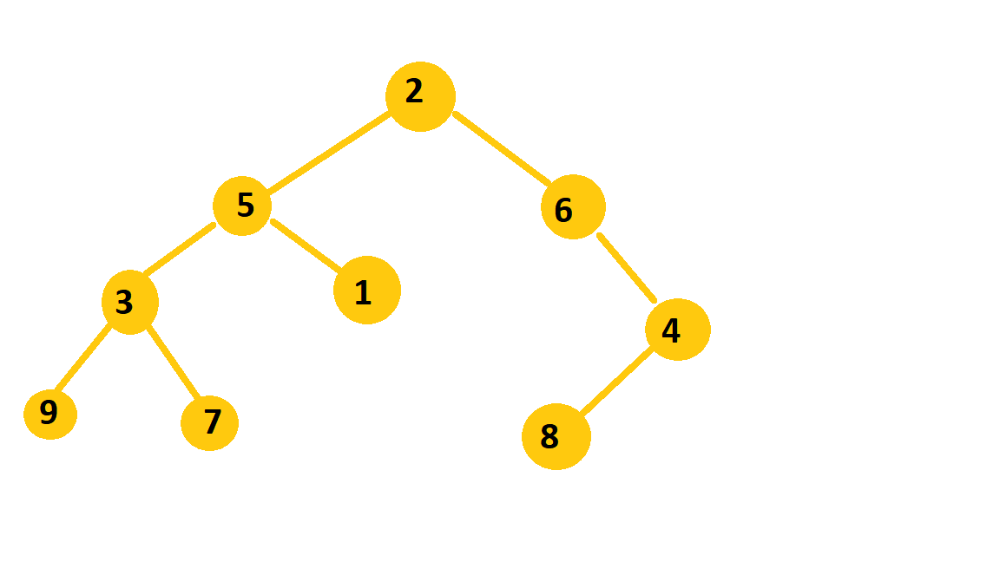

<h1>Algoritmos y Estructuras de Datos</h1>
<h2>Cursada 2022</h2>

Ejercitación de Árboles Binarios, de Expresión y Generales


1) Dado un árbol binario T cuyo recorrido
* postorden es A G F E B J I H C D
* recorrido inorden es A B G E F D J H I C

¿cuántos son los descendientes del nodo “C”?

```
RTA: 3

Partiendo del recorrido post orden, sabemos que la raíz del arbol es D, ya que es el último nodo que se procesa en dicho recorrido.
Luego, si analizamos la posición de D dentro del recorrido in orden:
  - Subarbol Izquierdo: A B G E F
  - Subarbol Derecho: J H I C

Quedándonos con el subarbol derecho, podemos volver a analizar en dónde está ese tramo dentro del recorrido post orden:
 - J I H C
De donde deducimos que C es la raíz, y consecuentemente J I H son sus hijos.
Es por eso que el nodo C tiene 3 descendientes.
```

2.- Defina árbol binario completo y árbol binario lleno. Ejemplifique. ¿Es verdad que todo árbol binario completo es lleno? ¿Y viceversa?

```
Dado un arbol binario de altura H, es lleno si:
 - Si cada nodo es de grado 2.
 - Todas sus hojas están en el mismo nivel.
Recursivamente, un arbol lleno es si:
 - T es un nodo simple:
 - T es un arbol de altura H, y sus nodos son llenos de altura h-1.

Por su parte, un arbol binario completo:
 - Es lleno de altura h-1
 - Su nivel H se completan de izquierda a derecha

Entonces, de acuerdo a lo definido previamente, es falso que todo arbol completo sea lleno (ya que el nivel H puede no estar lleno).
Por otra parte, todo arbol lleno necesariamente es completo.
```

3.- Suponga que para un árbol binario T con N nodos (N>0), el último nodo en postorden es el mismo que el último nodo en inorden, ¿qué se puede concluir?

* (a) El subárbol izquierdo de T es vacío
* (b) El subárbol derecho de T es vacío
* (c) Ningún nodo en el árbol tiene dos hijos
* (d) Hay a lo sumo 3 nodos en el arbol

```
RTA: B - El subarbol derecho es vacio.

Dado que los recorridos tienen la siguiente estructura:
  -Posorden: HI -> HD -> Raiz
  -In Orden: HI -> Raiz -> HD

Si el ultimo nodo pos orden es el mismo que el in orden, podemos concluir que el arbol no tiene hijos derechos.

```

4.- Se han estudiado los distintos recorridos de un árbol binario. Abajo se muestra un código que combina dos de ellos. ¿Cuál es el resultado si se llama con la raíz del árbol de la figura?

```java
public void traverse(ArbolBinario<T> a) {
  if (!a.esVacio()) {
    System.out.print(a.getDato());
    if (a.tieneHijoIzquierdo())
      traverse(a.getHijoIzquierdo());
      if (a.tieneHijoDerecho())
      traverse(a.getHijoDerecho());
    System.out.print(a.getDato());
  }
}
```
```
RTA: C A B B A E D D F F E C
```

5.- Evalúe la siguiente expresión postfija y determine cuál es el resultado. <BR>
6 5 * 7 3 − 4 8 + * +
* (a) 78
* (b) 66
* (c) 34
* (d) 44

```
Rta: 78

Recordando como funciona la construcción a partir de una expresión postfija:

  tomo un carácter de la expresión
  mientras ( existe carácter ) hacer
    si es un operando : creo un nodo y lo apilo.
    si es un operador: (lo tomo como la raíz de los dos últimos nodos creados)
        - creo un nodo R,
        - desapilo y lo agrego como hijo derecho de R
        - desapilo y lo agrego como hijo izquierdo de R
        - apilo R.
    tomo otro carácter
  fin

Es entonces como dicha expresión se transforma en la siguiente expresión geométrica:

(6 * 5) + [ (7-3) * (4+8)]
30 + [ 4 * 12] = 78
```

6.- Elija la expresión algebraica almacenada en el siguiente árbol:
* **a-** ((a – b / c) + d * e)
* **b-** (((a – b) / (c + d)) + d * e)
* **c-** ((a – b / c) + (d * e))
* **d-** (((a – b) / c) + (d * e))

```
RTA: la expresion es la D.
```

7.- ¿Cuál es el número mínimo de nodos en un árbol binario completo de altura 4?<br>
(a) 10 (b) 15 (c) 12 (d) 31 (e) 16

```
RTA: 16
en un arbol binario completo de altura H, la cantidad de nodos puede ir de:
* 2^H
* 2^(H+1) - 1

```

8.- Construya el árbol de expresión correspondiente a la siguiente expresión postfija. <br>
6 5 * 7 3 − 4 8 * + +



9.- Construya el árbol de expresión correspondiente a la siguiente expresión infija.

( A + ( B * C ) ) * ( D – E )



10.- Construya el árbol de expresión correspondiente a la siguiente expresión prefija

```+ + a e / * - b c d f```

¿Cuál es la profundidad del nodo d?
(a) 1 (b) 2 (c) 3 (d) 4



La profundidad es 3.

11.- Obtenga la expresión prefija de la siguiente expresión postfija:

`A B C * D - E F / G / - *`

12.- ¿Cuál de los siguientes árboles binarios tiene su recorrido inorden BCAD y preorden ABCD?


```
RTA: el arbol del grafico C cumple con las dos condiciones.
```

13.- Recontruya el árbol binario T cuyo recorrido preorden es 2 5 3 9 7 1 6 4 8 y su recorrido
inorden es 9 3 7 5 1 2 6 8 4.

```
Pre-Orden: R  -> HI -> HD
IN onrden: HI > R -> HD

 - Por el recorrido preorden sabemos que la raíz es 2.
 - Si ubicamos 2 en el recorrido in orden, podemos ver que el subarbol izquierdo es 9 - 3 - 7 - 5 - 1 y el subarbol derecho es 6 - 8 - 4.
 - Trabajando sobre el subarbol derecho, el 6 se encuentra primero en el recorrido preorden, con lo cual sabemos que es la raiz quedando 8 y 4 como descendientes hacia la derecha.
 - Luego gracias al recorrido preorden sabemos que 4 s la siguiente raiz, y al estar a el 8 a la izquierda en el In orden sabemos que es su hijo izquierdo.

 - Por el lado del subarbol izquierdo, 5 es la raiz ya que se encuentra primero en el recorrido preorde.
 - Analizando la posicion dle 5 en el inorden, vemos que 1 le queda como unico hijo dercho, y tiene un subarbol izquierdo formado por 9 3 y 7.
 - En el recorrido Preorden ubicamos 3 como la raiz de dicho subarbol, y si nos dirigimos al inorden vemos que 9 es su hijo derecho y 7 su hijo izquierdo.
```

