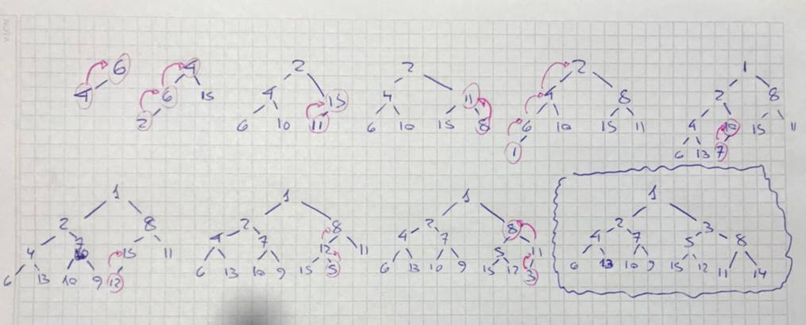
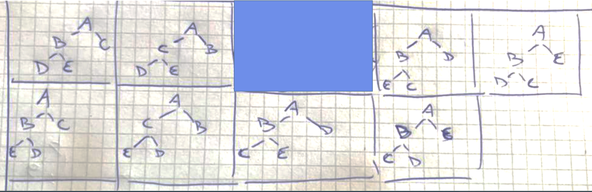
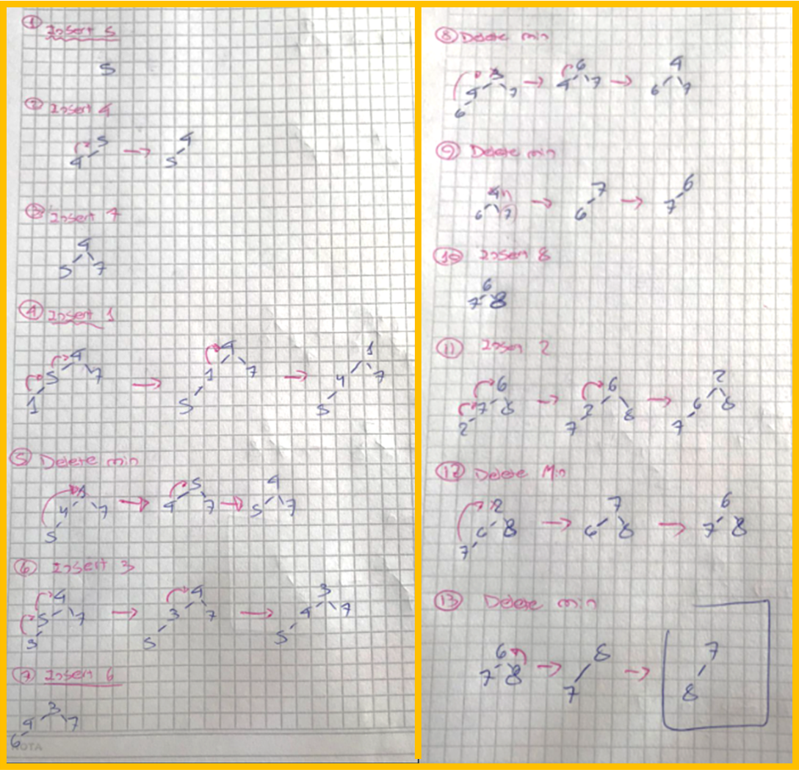
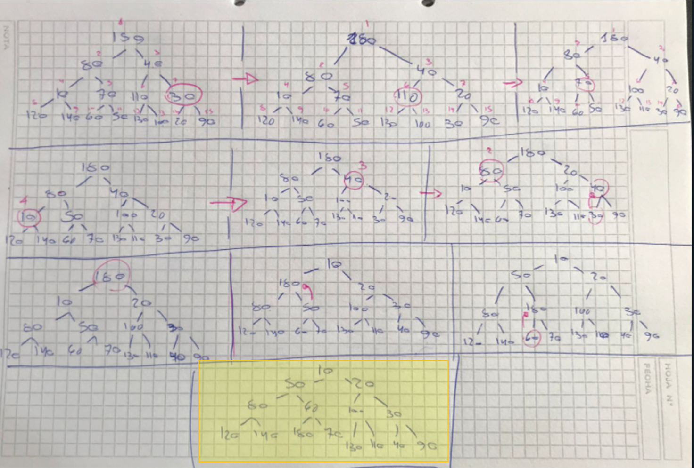
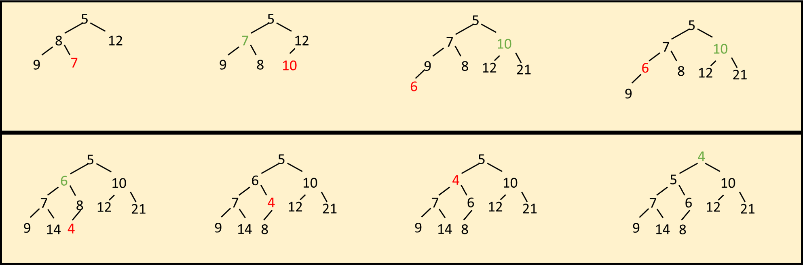
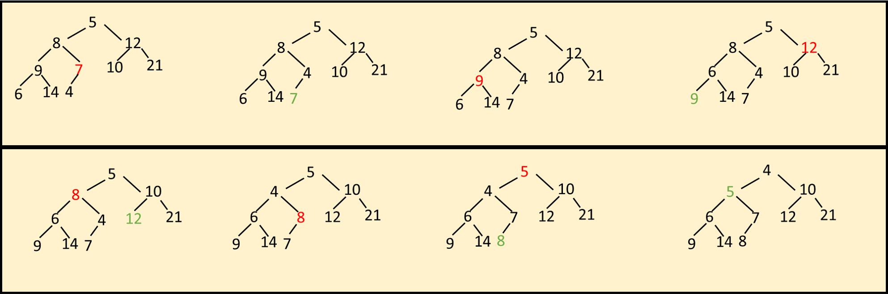

<h1>Algoritmos y Estructuras de Datos</h1>
<h2>Ejercitación sobre Colas de Prioridades - Heap</h2>


`Ejercicio 1`

`A partir de una heap inicialmente vacía, inserte de a uno los siguientes valores:
6, 4, 15, 2, 10, 11, 8, 1, 13, 7, 9, 12, 5, 3, 14`

Este ejercicio lo realizaremos con el tradicional Insert, de orden (n logN), que consiste en insertar de a uno cada elemento en ultimo lugar de la heap, y realizar sucesivamente filtrados ascendentes para restaurar al orden.

<br>


`Ejercicio 2`

`a) ¿Cuántos elementos hay, al menos, en una heap de altura h?`
Dado que una heap es un Arbol Binario Completo, como mínimo tenemos 2^h elementos.

`b) ¿Dónde se encuentra ubicado el elemento mínimo en una max-heap?`
En una Max-Heap, el elemento mínimo se encontrará en una hoja.

`c) ¿El siguiente arreglo es una max-heap : [23, 17, 14, 6, 13, 10, 1, 5, 7, 12] ?`

NO, ya que si lo analizamos en forma de arreglo, tenemos que cada nodo en la posición i tiene a sus hijos en 2*i y 2*i+1.<br>
Siendo una max heap, deberíamos verificar que todo elemento en i sea mayor que los respectivos elementos en 2*i y 2*i+1.

Esta propiedad de orden, no se cumple para el elemento 14, que tendría de hijo izquierdo al 10 y de hijo derecho al 1.

`Ejercicio 3`

`Dados los siguientes árboles, indique si representan una heap. Justifique su respuesta`

```
       1
    /    \
   3      7
         / \
        8  9
```
No, ya que no satisface la propiedad estructural, dado que una heap es un arbol binario completo, el último nivel debe completarse de izquierda a derecha.

```
       4
     /   \
    2     7
   / \   / \
  1   3 6   9
```
No, dado que no satisface la propiedad de orden.

Para ser una Min-Heap, el elemento padre debería ser inferior a sus hijos (no se cumple en elemento 4), y para ser una max heap, el elemento padre debería ser superior a sus hijos (tampoco se cumple en elemento 4).

`Ejercicio 4`

`Dibuje todas las min-heaps posibles para este conjunto de claves: {A, B, C, D, E}`

<br>

`Ejercicio 5`

`A partir de una min-heap inicialmente vacía, dibuje la evolución del estado de la heap al ejecutar las siguientes operaciones:`

`Insert(5), Insert(4), Insert(7), Insert(1), DeleteMin(), Insert(3), Insert(6), DeleteMin(), DeleteMin(),
Insert(8), DeleteMin(), Insert(2), DeleteMin(), DeleteMin()`

<br>

`Ejercicio 6`

`Aplique el algoritmo BuildHeap, para construir una min-heap en tiempo lineal, con los siguientes valores`

{150, 80, 40, 10, 70, 110, 30, 120, 140, 60, 50, 130, 100, 20, 90}

De acuerdo algoritmo BuildHeap, insertaremos los elementos en un arbol binario, y a partir de alli comenzaremos a aplicar filtrado hacia abajo desde el elemento en la posicion N/2

<br>

`Ejercicio 7`

`Aplique el algoritmo HeapSort, para ordenar descendentemente los siguientes elementos:`
{15, 18, 40, 1, 7, 10, 33, 2, 140, 500, 11, 12, 13, 90}

`Muestre paso a paso la ejecución del algoritmo sobre los datos`

Para el metodo heap-sort, necesitaremos construir una MinHeap con los elementos que se desean ordenar, intercambiar el último elemento con el primero, decrementar el tamaño de la heap y filtrar hacia abajo.

`Ejercicio 8`

`Construir una max-heap binaria con los siguientes datos:`

{5, 8, 12, 9, 7, 10, 21, 6, 14, 4}

`a) Insertándolos de a uno`

<br>

`b) Usando el algoritmo BuildHeap`

<br>

`Ejercicio 9`

`Suponga que una heap que representa una cola de prioridades está almacenada en el arreglo A (se comienza de la posición A[1]). Si insertamos la clave 16, ¿en qué posición quedará?`

<br>

Graficamente, la heap es:
```
                       11
                    /      \
                  21        27
                /   \      /   \
              37    36    34    32
            /  \   /  \   /
           43  44 42  51 62
```
La clave se insertaría en la posición 13 inicialmente. Si luego se realiza un percolate up para restaurar la propiedad de orden, lo primero que haría sería intercambiar lugar con el 34, para posteriormente terminar en el lugar del 27 `(posición 2)`


`Ejercicio 12`

`¿Cuáles de los siguientes arreglos representan una max-heap, min-heap o ninguna de las dos?`
* **arreglo 1: 0 1 2 0 4 5 6 7 8 9** --> ❌ Ninguna
* **arreglo 2: 9 8 7 6 5 4 3 2 1 0** --> ✔ Max Heap
* **arreglo 3: 5 5 5 6 6 6 6 7 7 1** --> ❌ Ninguna
* **arreglo 4: 9 3 9 2 1 6 7 1 2 1** --> ✔ Max Heap
* **arreglo 5: 8 7 6 1 2 3 4 2 1 2** --> ❌ Ninguna
