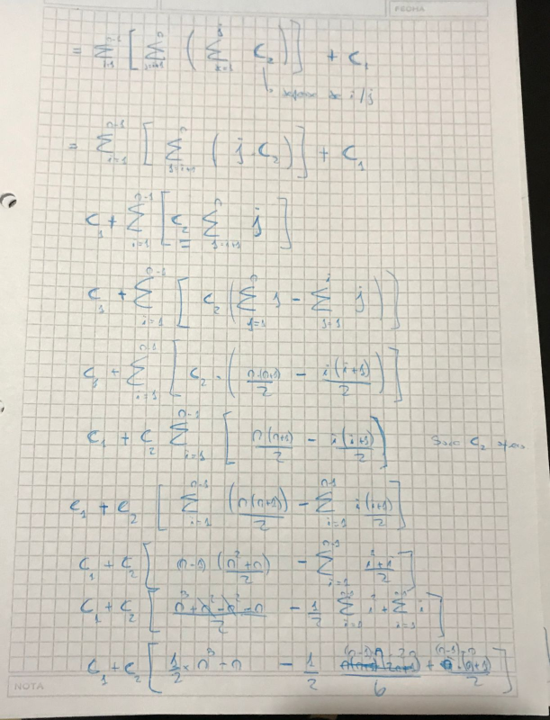
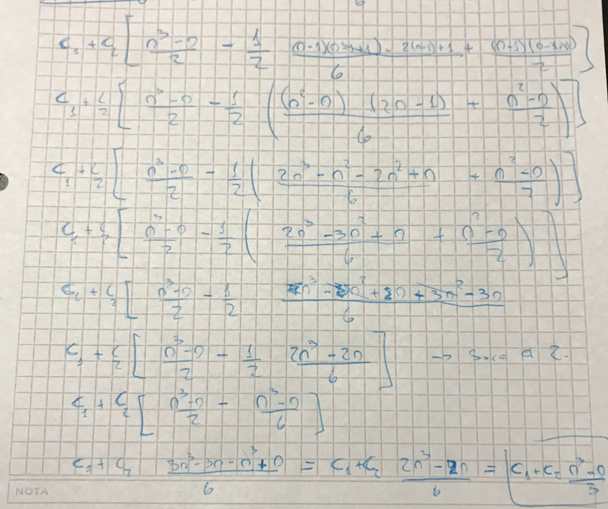
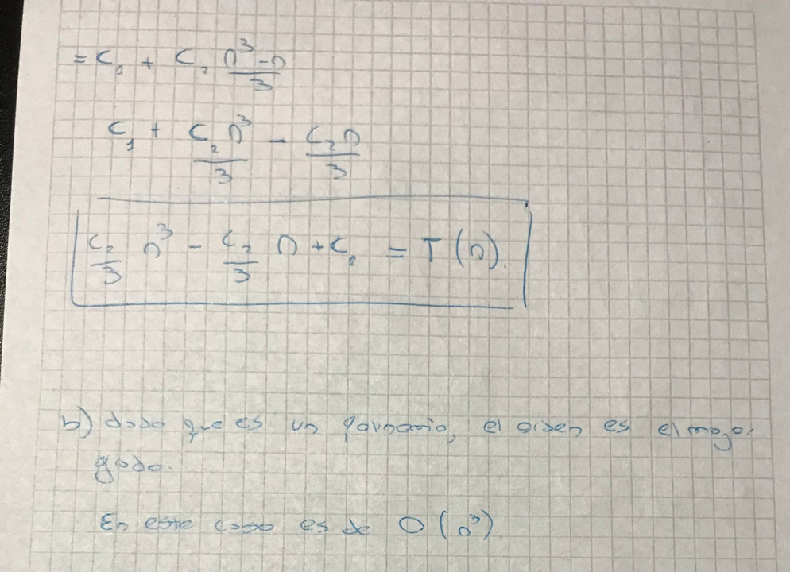

`Para cada uno de los algoritmos presentados:`

* a. Expresar en función de n el tiempo de ejecución.
* b. Establecer el orden de dicha función usando notación big-Oh.

```java
public static void uno (int n) {
  int i, j, k ;
  int [] [] a, b, c;
  a = new int [n] [n];
  b = new int [n] [n];
  c = new int [n] [n];
  for ( i=1; i<=n-1; i++) {
    for ( j=i+1; j<=n; j++) {
      for ( k=1; k<=j; k++) {
        c[i][j] = c[i][j]+ a[i][j]*b[i][j];
      }
    }
  }
  }
```






