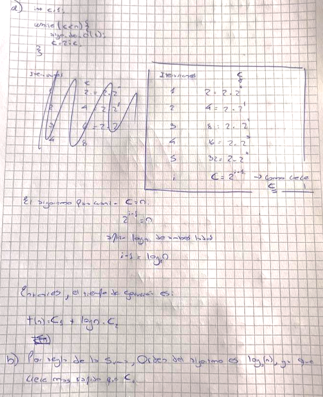
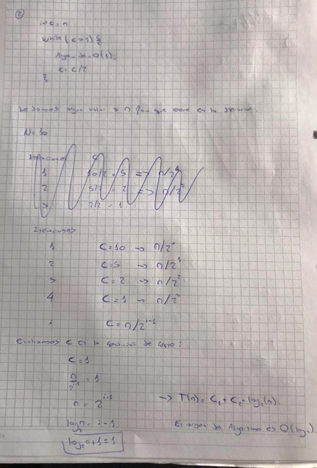

Para cada uno de los algoritmos presentados calcule el T(n).

a. Expresar en función de n el tiempo de ejecución.
<br>b. Establecer el orden de dicha función usando notación big-Oh

```java
int c=1;
while (c<n){
  algo_de_O(1);
  c= c*c;
}
```




2)

```java
int c = n

while(c>1){
  algo_orden(1);
  c = c/2
}
```


