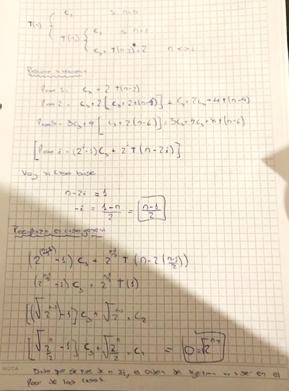

* a. Exprese la función del tiempo de ejecución de cada uno de los siguientes algoritmos,
resuélvala y calcule el orden.
* b. Comparar el tiempo de ejecución del método ‘rec2’ con el del método ‘rec1’.
* c. Implementar un algoritmo más eficiente que el del método rec3 (es decir que el T(n) sea
menor).

```java
package estructurasdedatos;

  public class Recurrencia {
    static public int rec2(int n){
      if (n <= 1)
        return 1;
      else
        return (2 * rec2(n-1));
      }

    static public int rec1(int n){
      if (n <= 1)
        return 1;
      else
        return (rec1(n-1) + rec1(n-1));
      }

    static public int rec3(int n){
      if ( n == 0 )
        return 0;
      else {
        if ( n == 1 )
          return 1;
        else
          return (rec3(n-2) * rec3(n-2));
      }
    }

    static public int potencia_iter(int x, int n){
      int potencia;
      if (n == 0)
        potencia = 1;
      else {
        if (n == 1)
          potencia = x;
        else{
          potencia = x;
          for (int i = 2 ; i <= n ; i++) {
            potencia *= x ;
          }
        }
      }
      return potencia;
    }

    static public int potencia_rec( int x, int n){
      if( n == 0 )
        return 1;
      else{
        if( n == 1)
          return x;
        else{
          if ( (n % 2 ) == 0)
            return potencia_rec (x * x, n / 2 );
          else
            return potencia_rec (x * x, n / 2) * x;
          }
        }
      }
    }


```

-----------------------------------------------------------

Solucion Punto A

```java

    static public int rec1(int n){
      if (n <= 1)
        return 1;
      else
        return (rec1(n-1) + rec1(n-1));
      }
```


```java

    static public int rec2(int n){
      if (n <= 1)
        return 1;
      else
        return (2 * rec2(n-1));
      }
```


```java

    static public int rec3(int n){
      if ( n == 0 )
        return 0;
      else {
        if ( n == 1 )
          return 1;
        else
          return (rec3(n-2) * rec3(n-2));
      }
    }
```




```java

    static public int potencia_iter(int x, int n){
      int potencia;
      if (n == 0)
        potencia = 1;
      else {
        if (n == 1)
          potencia = x;
        else{
          potencia = x;
          for (int i = 2 ; i <= n ; i++) {
            potencia *= x ;
          }
        }
      }
      return potencia;
    }
```


```java

    static public int potencia_rec( int x, int n){
      if( n == 0 )
        return 1;
      else{
        if( n == 1)
          return x;
        else{
          if ( (n % 2 ) == 0)
            return potencia_rec (x * x, n / 2 );
          else
            return potencia_rec (x * x, n / 2) * x;
          }
        }
      }
    }
```


