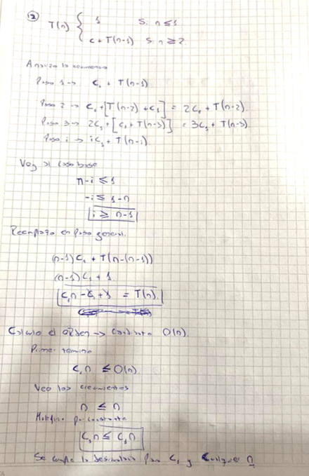
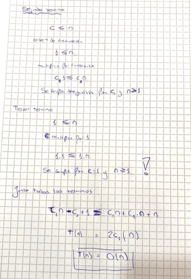
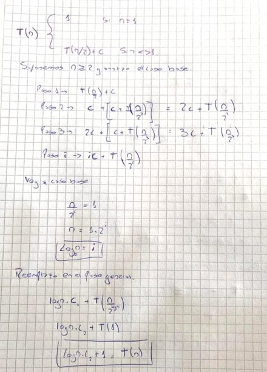
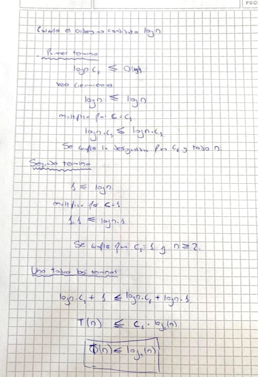

Ejercicio 12

Resuelva las recurrencias y calcule el orden. Para cada recurrencia se muestra a modo de ejemplo el
código correspondiente.

```java
int recursivo(int n){
  if (n <= 1)
    return 1;
  else
    return (recursivo (n-1));
}
```






```java
int recursivo(int n){
if (n = 1)  
  return 1;
else
  return (recursivo (n/2));
}
```




